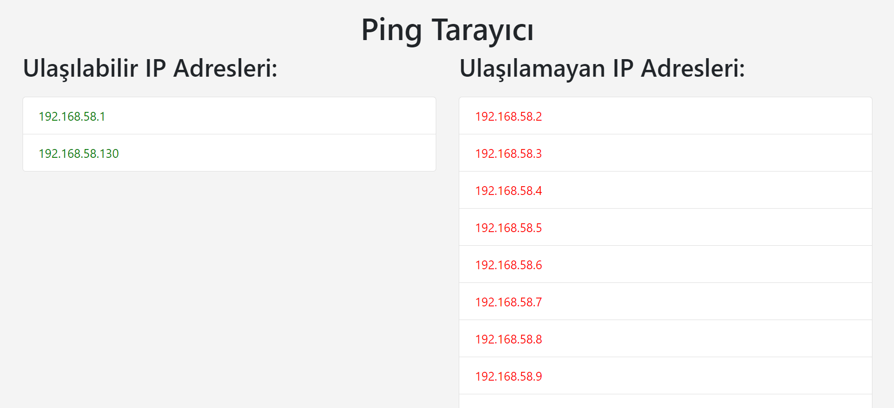

# Ping Tarayıcı

Bu proje, belirli bir IP aralığına ping atarak ulaşılabilir ve ulaşılamayan IP adreslerini tespit eden bir web uygulamasıdır. Uygulama, Flask framework'ü kullanılarak geliştirilmiştir ve ping sonuçlarını anlık olarak gösterir.



## Özellikler

- Belirtilen IP aralığına ping atma
- Ulaşılabilir ve ulaşılamayan IP adreslerini listeleme
- Anlık güncellemeler ile sonuçları gösterme
- Modern ve kullanıcı dostu bir web arayüzü

## Gereksinimler

Bu projeyi çalıştırmak için aşağıdaki Python kütüphanelerine ihtiyacınız var:

- Flask

## Kurulum

1. **Python ve pip'in yüklü olduğundan emin olun.** Python 3.6 veya daha üst bir sürüm gereklidir.

2. **Proje dizinine gidin.** Terminal veya komut istemcisinde aşağıdaki komutu kullanarak proje dizinine gidin:

   ```bash
   cd /path/to/your/project
   ```

3. **Gereksinimleri yükleyin.** Aşağıdaki komutu çalıştırarak gerekli kütüphaneleri yükleyin:

   ```bash
   pip install -r requirements.txt
   ```

4. **Uygulamayı çalıştırın.** Aşağıdaki komutu kullanarak uygulamayı başlatın:

   ```bash
   python pingscanning.py
   ```

5. **Tarayıcıda açın.** Uygulama çalıştıktan sonra, tarayıcınızda `http://127.0.0.1:5000` adresine gidin.

## Kullanım

Uygulama açıldığında, ping atılan IP adreslerinin durumunu görebilirsiniz. Ulaşılabilir IP adresleri yeşil renkte, ulaşılamayan IP adresleri ise kırmızı renkte gösterilir. Sonuçlar her 5 saniyede bir güncellenir.


## Lisans

Bu proje MIT Lisansı altında lisanslanmıştır. Daha fazla bilgi için LICENSE dosyasına bakın.
